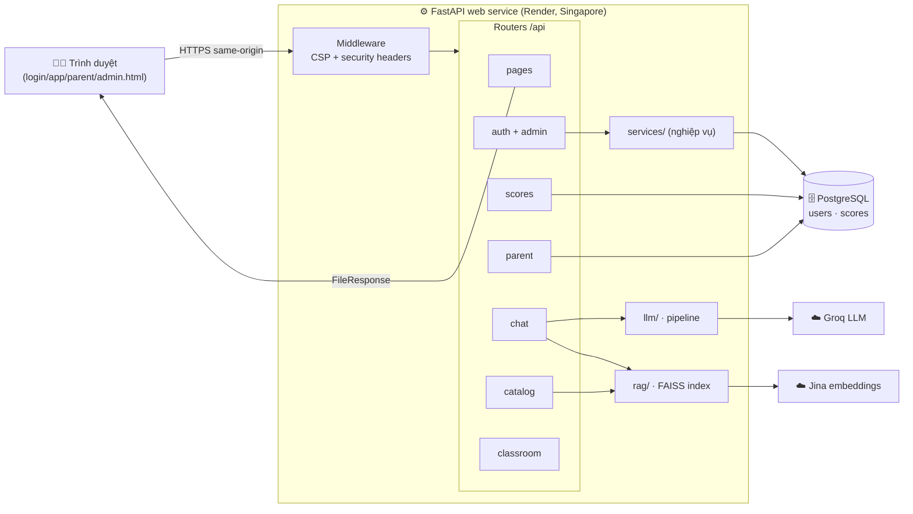
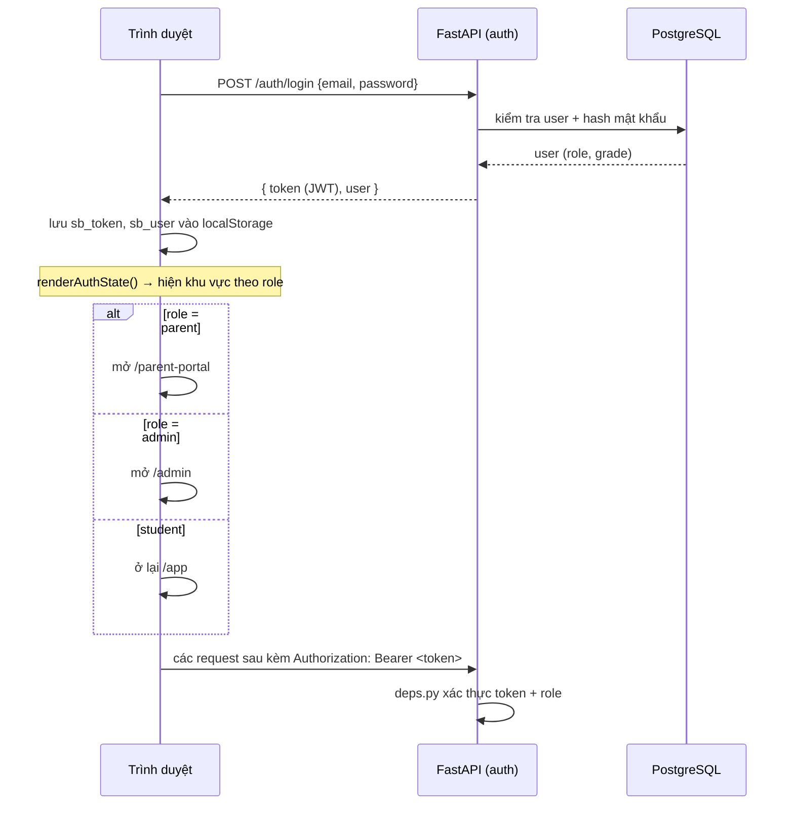
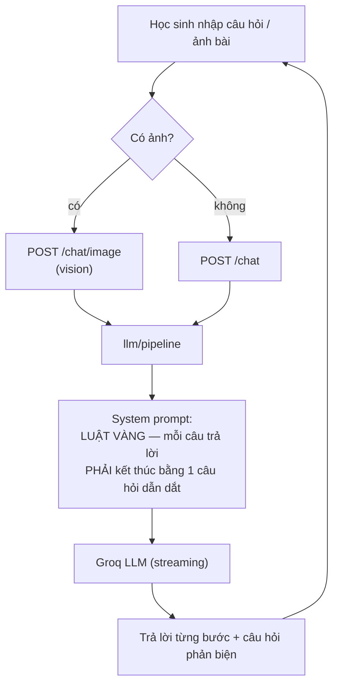
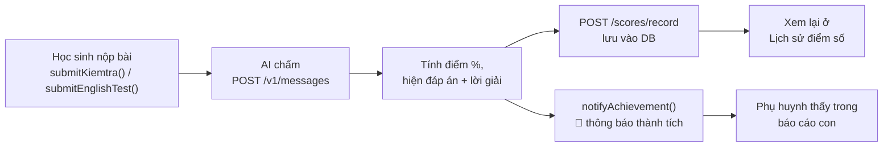
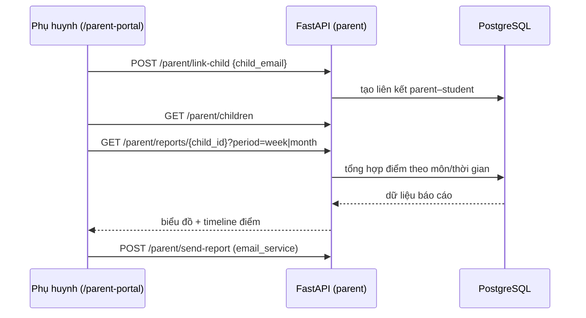
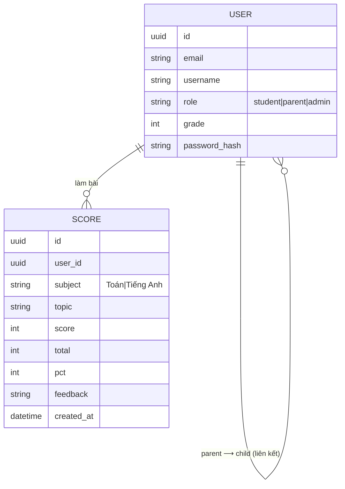

# 🧠 ARCHITECTURE & LOGIC — SmartBuddy (BuddyMath)

Tài liệu mô tả **cách website hoạt động**: kiến trúc, các luồng xử lý chính, phân
quyền và danh mục API. Xem bản đồ trang ở [SITEMAP.md](SITEMAP.md).

---

## 1. Công nghệ & phân lớp

**Một web service duy nhất** (FastAPI) vừa chạy API, vừa trả các trang HTML trong
`buddymath/FE/` → same-origin, không CORS, không cần host FE riêng.

| Lớp | Thư mục | Nhiệm vụ |
|-----|---------|----------|
| Presentation | `BE/app/api/` | Routers: `pages, auth, scores, parent, chat, catalog, classroom` |
| Nghiệp vụ | `BE/app/services/` | `auth_service`, `synthesis_service`, `email_service`, `runtime` (singletons) |
| Dữ liệu | `BE/app/models/` + `core/database.py` | ORM `User`, `Score` · PostgreSQL (prod) / SQLite (dev) |
| DTO | `BE/app/schemas/` | Pydantic validate request/response |
| AI — RAG | `BE/app/rag/` | `engine`, `chunking`, `embedder` (Jina), `router` · vector index **FAISS** |
| AI — LLM | `BE/app/llm/` | `client` (Groq), `pipeline` |
| Frontend | `FE/*.html` | SPA thuần (HTML/CSS/JS), gọi API cùng origin, lưu JWT ở `localStorage` |

**Bảo mật HTTP** (middleware trong `main.py`): CSP, `X-Content-Type-Options`,
`X-Frame-Options`, `Referrer-Policy`, `Permissions-Policy`, HSTS.

---

## 2. Kiến trúc tổng thể

---

## 3. Luồng đăng nhập & phân quyền

- Token JWT ký bằng `SECRET_KEY`; FE đính kèm `Authorization: Bearer` cho mọi API cần đăng nhập.
- Khi mở lại trang: `restoreSession()` đọc `localStorage`, gọi `GET /auth/me` để xác thực token còn hiệu lực.

---

## 4. Luồng gia sư AI (Socratic — không giải hộ)

> Triết lý sản phẩm: Buddy **hướng dẫn tư duy**, luôn hỏi lại để học sinh tự tìm ra
> đáp án — không đưa lời giải sẵn.

---

## 5. Luồng kiểm tra → điểm số → thông báo

**Trung tâm thông báo (FE, `localStorage` theo từng user):** `pushNotification(type,…)`
được gọi ở các mốc — đăng nhập, đăng xuất, đăng ký, liên kết phụ huynh, hoàn thành
bài kiểm tra (`achievement`/`perfect`/`reminder`), cảnh báo lỗi, chào mừng. Badge đếm
số chưa đọc; mỗi user có kho riêng (`sb_notif_<email>`).

---

## 6. Luồng phụ huynh ↔ học sinh

---

## 7. Danh mục API

| Nhóm | Method & Path | Mô tả |
|------|---------------|-------|
| **Pages** | `GET /`, `/app`, `/parent-portal`, `/admin`, `/health` | Trả HTML / health |
| | `GET /robots.txt`, `/sitemap.xml` | SEO (sinh động theo domain) |
| **Auth** | `POST /auth/register` · `POST /auth/login` | Đăng ký / đăng nhập → JWT |
| | `GET /auth/me` · `POST /auth/update-profile` | Thông tin / cập nhật hồ sơ |
| **Admin** | `GET /admin/users` · `GET /admin/stats` | Danh sách user / thống kê |
| | `POST /admin/users` · `PATCH /admin/users/{id}` | Tạo / sửa user |
| | `POST /admin/users/{id}/reset-password` · `DELETE /admin/users/{id}` | Reset mật khẩu / xoá |
| **Scores** | `POST /scores/record` · `GET /scores/history` · `GET /scores/summary` | Lưu / xem / tổng hợp điểm |
| **Parent** | `POST /parent/link-child` · `GET /parent/children` | Liên kết / danh sách con |
| | `GET /parent/reports/{child_id}` · `POST /parent/send-report` | Báo cáo / gửi email |
| **Chat (AI)** | `POST /chat` · `POST /chat/stream` · `POST /chat/image` · `POST /v1/messages` | Hỏi đáp / streaming / vision / chấm bài |
| **Catalog** | `GET /subjects` · `GET /subjects/{s}/topics` | Danh mục môn / chủ đề |
| | `GET /topics/{s}/{t}/content` · `.../chunks` · `.../synthesis` | Nội dung / RAG chunks / tổng hợp |
| | `POST /ingest` · `POST /ingest/reload` | Nạp tài liệu vào FAISS |
| **Classroom** | `GET /classroom/{s}/{t}/files` · `POST /classroom/lesson` | Tài liệu lớp / bài giảng |

---

## 8. Mô hình dữ liệu (rút gọn)

> ⚠️ Trên Render dùng **PostgreSQL** (bền), không dùng SQLite (filesystem ephemeral →
> mất dữ liệu mỗi lần redeploy). Xem [DEPLOY.md](DEPLOY.md).
