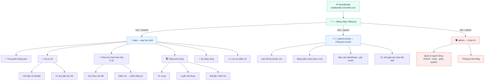

# 🗺️ SITEMAP — SmartBuddy (BuddyMath)

Web app **gia sư AI** (Toán · Tiếng Anh · Kỹ năng sống) cho học sinh lớp 3–9 theo
chương trình Bộ GD&ĐT. Backend **FastAPI** phục vụ **cả** trang HTML (FE) lẫn API —
_same-origin_, không tách host, không CORS.

> Base URL (production): `https://buddymath.onrender.com`
> Sitemap SEO sinh động tại `/sitemap.xml` · quy tắc thu thập tại `/robots.txt`

---

## 1. Các trang (routes trả HTML)

| URL | File FE | Dành cho | SEO |
|-----|---------|----------|-----|
| `/` | `FE/login.html` | Công khai — đăng nhập / đăng ký | ✅ index |
| `/app` | `FE/mathbuddy-kids.html` | Học sinh (sau đăng nhập) | ✅ index |
| `/parent-portal` | `FE/parent.html` | Phụ huynh | 🔒 gated |
| `/admin` | `FE/admin.html` | Quản trị viên | 🚫 noindex |
| `/health` | — | Health check (JSON) | — |
| `/robots.txt` · `/sitemap.xml` | sinh động | Bot tìm kiếm | — |
| `/docs` · `/redoc` | FastAPI tự sinh | API docs (nên chặn/khoá khi lên production) | 🚫 disallow |

---

## 2. Sơ đồ cây trang

---

## 3. Phân quyền theo vai trò

| Khu vực | 🎒 Student | 👨‍👩‍👧 Parent | 🛡️ Admin |
|---------|:---------:|:-----------:|:--------:|
| `/app` — học tập, chat AI, kiểm tra | ✅ | – | – |
| Lịch sử điểm số của bản thân | ✅ | – | – |
| `/parent-portal` — theo dõi con | – | ✅ | – |
| Liên kết & xem điểm của con | – | ✅ | – |
| `/admin` — quản lý toàn bộ user | – | – | ✅ |

Điều hướng do JWT + `role` quyết định: sau khi đăng nhập, `renderAuthState()` (FE)
ẩn/hiện các khu vực; API kiểm tra token + vai trò ở backend (`deps.py`).

---

## 4. Các mục trong app học sinh (`/app`)

Sidebar là bản đồ điều hướng chính (SPA — chuyển panel, không tải lại trang):

- **🤖 Gia sư AI** — `Hỏi đáp với Buddy`, `Tư duy đặt câu hỏi`
- **📐 Toán học** — hub theo lớp: học chủ đề · làm bài kiểm tra (AI chấm)
- **🌏 Tiếng Anh** — hub: từ vựng · hội thoại · bài tập
- **🌟 Kỹ năng sống** — các chủ đề: ra quyết định, giao tiếp, quản lý thời gian…
- **📈 Lịch sử điểm số** — bảng điểm đã lưu (theo môn)
- **🔔 Thông báo** — đăng nhập/xuất, đăng ký, liên kết PH, thành tích sau kiểm tra…

Xem chi tiết luồng hoạt động & API trong [ARCHITECTURE.md](ARCHITECTURE.md).
